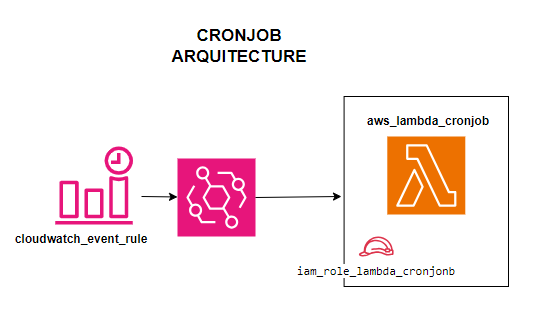

# MODULO: CRONJOB CON LAMBDA

## RECURSOS CREADOS
1. AWS Lambda function
2. AWS IAM role para la funcion Lambda
3. Evento cron de Cloudwatch
4. Permiso de ejecucion de Lambda para Cloudwatch
5. Asociacion de target EventCloudwatch-Lambda

## VARIABLES DE ENTRADA
- function_name: Nombre de la funcion Lambda.
- role_name: Nombre del rol IAM que tomara Lambda para las ejecuciones.
- cloud_event_name: Nombre del evento de tiempo cloudwatch.
- cron_expression: Expresion cron para el evento:
    - "cron(0 * * * ? *)  ->  Ejecuta al inicio de cada hora
    - "cron(* * * * ? *)  ->  Ejecuta cada minuto
    - "cron(0 0 12 ? * MON *)  ->  Ejecuta cada lunes a las 12
### OPCIONALES
- managed_policy_arns: Lista de politicas que se aduntaran al rol de Lambda. Por defecto usa la politica gestionada **BasicExecutionRole**.
- role_description: Descripcion del rol para lambda.
- cloudwatch_event_rule_description: Descripcion del evento cloudwatch.
- runtime: Por defecto **nodejs18.x**.
    - "python3.8"
    - "nodejs20.x"
- handler: Por defecto **index.lambda_handler**.
- layers: Lista de Layer's ARNs.
- period: DESCRIPTIVO: Define la periodicidad para completar el target id del cronjob (no espacios. Ejm cada_hora, todo_lunes_8am)

